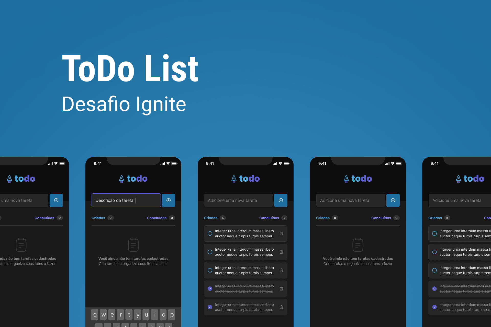

<p align="center">
  
</p>

<h1 align="center">
	Todo List App
</h1>

<p align="center">Desafio 01 - Praticando os conceitos do React Native</p>

<p align="center">
  <a href="https://github.com/italoalvesdev">
    
  </a>

  <a href="https://www.linkedin.com/in/italo-alvess/" target="_blank">
    
  </a>
</p>

## 🚀 Projeto

Aplicação de controle de tarefas no estilo **to-do-list**, que contém as seguintes funcionalidades:
- Adicionar uma nova tarefa
- Marcar e desmarcar uma tarefa como concluída
- Remover uma tarefa da listagem
- Mostrar o progresso de conclusão das tarefas

## 🔧 Tecnologias

- React Native
- TypeScript
- Styled Components
- [react-native-svg](https://docs.expo.dev/versions/latest/sdk/svg/)
- [react-native-responsive-fontsize](https://github.com/heyman333/react-native-responsive-fontSize)

## :octocat: Instalação

### Requisitos
- [Expo-CLI](https://docs.expo.dev/get-started/installation/)

Para clonar o repositório

```sh
git clone https://github.com/italoalvesdev/todo-list-app
```

Para instalar as dependências com NPM

```sh
npm install | npm i
```

Para instalar as dependências com Yarn

```sh
yarn | yarn install
```

Iniciar o ambiente de desenvolvimento com NPM

```sh
npm start
```

Iniciar o ambiente de desenvolvimento com Yarn

```sh
yarn start
```
---

Feito com ♥ by [Italo Alves](https://www.linkedin.com/in/italo-alvess/)
